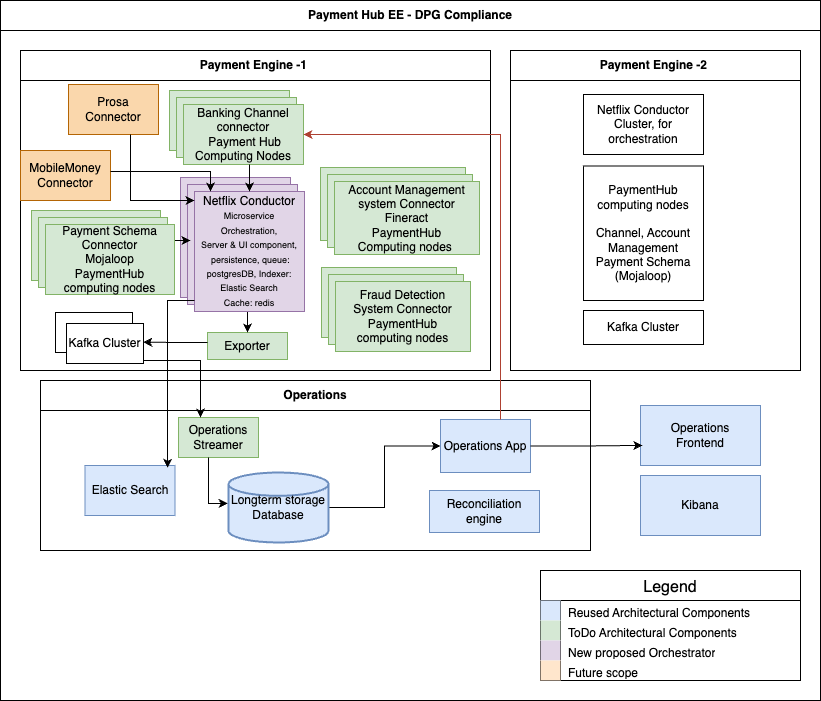

# ph-ee-dpg-core
PH-EE-DPG for Netflix Conductor workflow engine solution with the DPG compliant abstraction layer
# dpga
Digital Public Goods Alliance middleware for integration to real-time payment systems.

### Why use orchestrator
Orchestration tools streamline complex workflows, ensuring tasks are executed in a coordinated and efficient manner, enhancing scalability and reliability

### Why Netflix Conductor
Netflix Conductor, designed by Netflix for microservices architecture, offers a robust, scalable, and fault-tolerant orchestration solution with intuitive workflow management and extensive integration capabilities

## ph-ee-dpg flow diagram

# Modules

There are 4 modules in this repo currently
- [ph-ee-dpg-connector-channel](ph-ee-dpg-connector-channel) - to initiate transfer request
- [ph-ee-dpg-exporter](ph-ee-dpg-exporter) - Export eventing data from Conductor to Kafka using Conductor Listeners
- [ph-ee-dpg-importer-rdbms](ph-ee-dpg-importer-rdbms) - Import payloads from Kafka, parse and save data to mysql database
- [ph-ee-dpg-connector-ams-mifos](ph-ee-dpg-connector-ams-mifos) - has workers that consume Fineract(ams) apis

